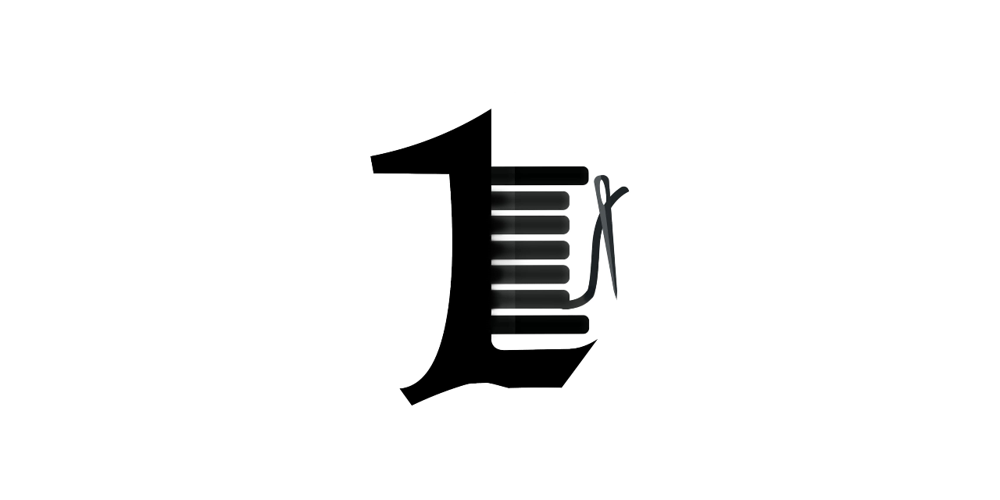

If any Issue - Problem ... [Report here](https://github.com/withrvr/1Link/issues/new/choose)
<br>
Want to know more or any thing related to /withrvr/1Link/ ... [Click Here and Fill Free to Discuss with the Community](https://github.com/withrvr/1Link/discussions)

[](#what-is-1link---withrvr--)
<br>

# What is 1Link ( ~ @withrvr ) :

-   Aim : To create the Universal link
-   Combine all URL's links to share in one URL `( called as Slice in project )`
-   Status

```
Backend - Done
Front End - Modifying
```

-   [For More Detail on Curretly Status](./To_Do.md)

# URL's Mapping :

## Syntax :

-   Slice info : `https://example.com/{ userName }/{ sliceName }/`
-   User info : `https://example.com/{ userName }/`
<!-- -   ???: `https://example.com/:userName/:userName/` -->

## Example ( for User @withrvr ) :

-   Slices info :
    -   Sponsers : `/withrvr/All_Sponsers/`
    -   Gadgets which U use : `/withrvr/Equipments/`
    -   Social Media links .. like twitter, yt, insta, fb : `/withrvr/Social-Media/`
    -   . . . etc
-   User info : `/withrvr/`
